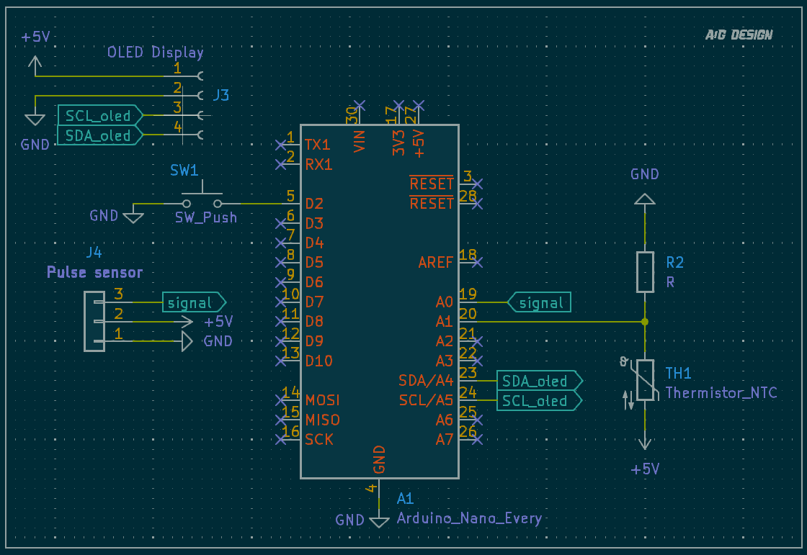

# Stress Monitor

## Introduction

Cold hands are tense, warm hands are relaxed.

The Stress Monitor is a great tool for:

- Learning hand-warming relaxation techniques.
- Seeing your stress response and training yourself to relax.
- Measuring relaxation effectiveness with quantitative data.

## Demo Video

Watch the demo video to see how the Stress Monitor works:

Click the image or [this link](https://youtu.be/toidenUyGGE) to view the video.

### Key Features:

- **Temperature Range:** Measures temperature from 58°F to 150°F (approximately 14°C to 65°C).
- **Stress Level Categories:**

| Temperature (F°) | Temperature (C°) | Stress Level   |
| ----------------- | ----------------- | -------------- |
| Below 79°F        | Below 26°C        | Highly Tense   |
| 79-84°F           | 26-29°C           | Tense          |
| 84-90°F           | 29-32°C           | Calm           |
| 90-95°F           | 32-35°C           | Relaxed        |
| Over 95°F         | Over 35°C         | Deeply Relaxed |

---

## How It Works

Your temperature is connected to your stress level:

- **When tense:** Blood circulation in your hands and feet is reduced, causing a drop in temperature.
- **When relaxed:** Peripheral blood circulation increases, warming your hands and feet.

With simple stress-reduction exercises, you can increase your blood flow, raising your temperature.

---

## Relaxation Training Techniques

1. **Baseline Temperature Measurement:**

   - Use the Stress Monitor to gauge your starting temperature and stress level.
   - Observe moment-to-moment skin temperature changes in response to stress.

2. **Breathing Exercise:**

   - Breathe from your lower diaphragm, not your upper lungs.
   - Inhale fully through your nose, hold for a moment, and exhale slowly through your mouth.
   - Repeat, aiming for 6-12 breaths per minute.
   - Watch your temperature increase as you relax.

3. **Goals for Relaxation Training:**

   - Consistently raise your temperature to 95°F (35°C) or higher.
   - Maintain that temperature throughout your training session.
   - Develop the ability to recognize subtle changes in your hand temperature throughout the day without the Stress Monitor.
   - Learn to increase your hand temperature during stressful situations.

---
## Circuit Diagram

Below is the circuit diagram for the Stress Monitor project:

---
## Future Features

This project is actively being developed, and more features will be added to enhance functionality and user experience. Stay tuned!
